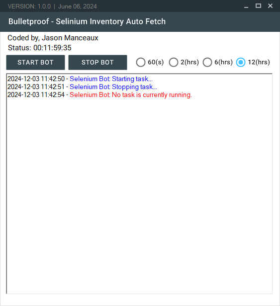

# **Selenium Auto Inventory Bot**



A **Selenium-based automation tool** that interacts with a warehouse management system to download inventory reports in `.xlsx` format at user-defined intervals.

[GitHub Repository](https://github.com/tw0rmer/Selinium-Auto-Inventory.git)

---

## **Features**

1. **Automated Inventory Management**:
   - Logs into a warehouse management system.
   - Navigates to the inventory section.
   - Downloads inventory reports in `.xlsx` format.

2. **Interval-Based Execution**:
   - Runs at predefined intervals: 60 seconds, 2 hours, 6 hours, or 12 hours.

3. **Customizable User Data Directory**:
   - Configures Chrome profiles for session persistence.

4. **Modern User Interface**:
   - Built using **MaterialSkin** for an elegant and responsive design.

5. **Detailed Logging**:
   - Logs activities in real-time.
   - Autosaves logs periodically to a file.

6. **Error Handling**:
   - Provides comprehensive error logs for troubleshooting.

---

## **Getting Started**

### **System Requirements**

- **Operating System**: Windows 10/11
- **Development Environment**: Visual Studio with .NET Framework support
- **Dependencies**:
  - `Selenium.WebDriver`
  - `Selenium.WebDriver.ChromeDriver`
  - `MaterialSkin`
  - `Newtonsoft.Json`

### **Setup Instructions**

1. **Clone the Repository**:
   ```bash
   git clone https://github.com/tw0rmer/Selinium-Auto-Inventory.git
   cd Selinium-Auto-Inventory
